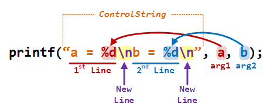

# Usar_C18_Native
> Ejemplo de uso de la librería "usart.h".
> modo nativo; con el Pic **18F4620**
> 
 por: Rommel Contreras - _rommeljose@gmail.com_

> Este programa, permite la exploración y uso de la librería usart.h del compilador C18 (MPLAB® C18); de uso general para la familia de
> microcontroladores PIC18xxx.
> El programa se desarrollo como plataforma para paracticar las utilidades de impresión o salida al puerto serial, tales como:

> Esto requiere del uso y configuración de un Puerto Serial, basada en un módulo UART del Pic utilizado. 
>> **ver:** [MPLAB_C18_Libraries_51297e.pdf](MPLAB_C18_Libraries_51297e.pdf)

>> El propósito de esta práctica de laboratorio es ilustrar el uso de la función de biblioteca C estándar printf() . Dado que su propósito original era imprimir texto en el dispositivo de salida estándar de una computadora (pantalla de monitor o impresora),

Uso del printf ---> 

## Funciones que tienen salida por el puerto serial:

`fprintf`	Formatted string output to a stream.

`fputs` String output to a stream.

`printf` Formatted string output to stdout.

`putc` Character output to a stream

`puts` String output to stdout.

`sprintf` Formatted string output to a data memory buffer.

`vfprintf` Formatted string output to a stream with the arguments for processing the format string supplied via the stdarg facility.

`vprintf` Formatted string output to stdout with the arguments for processing the format string supplied via the stdarg facility.

`vsprintf` Formatted string output to a data memory buffer with the arguments for processing the format string supplied via the stdarg facility.

`_usart_put`c Single character output to the USART (USART1 for devices which have more than one USART).

`_user_putc` Single character output in an application defined manner.

Ejemplos printf ---> 

## Especificadores de formatos:

%c	Single character

%s	String (all characters until '\0')

%d	Signed decimal integer

%o	Unsigned octal integer

%u	Unsigned decimal integer

%x	Unsigned hexadecimal integer with lower case digits (e.g. 1a5e)

%X	Same as %x but with upper case digits (e.g. 1A5E)

%f	Signed decimal value (floating point)

%e	Signed decimal value with exponent (e.g. 1.26e-5)

%E	Same as %e but uses upper case E for exponent (e.g. 1.26E-5)

%g	Same as %e or %f, depending on size and precision of value

%G	Same as %g but will use capital E for exponent

>> **ver:** [The printf() Function](https://microchipdeveloper.com/tls2101:printf))
